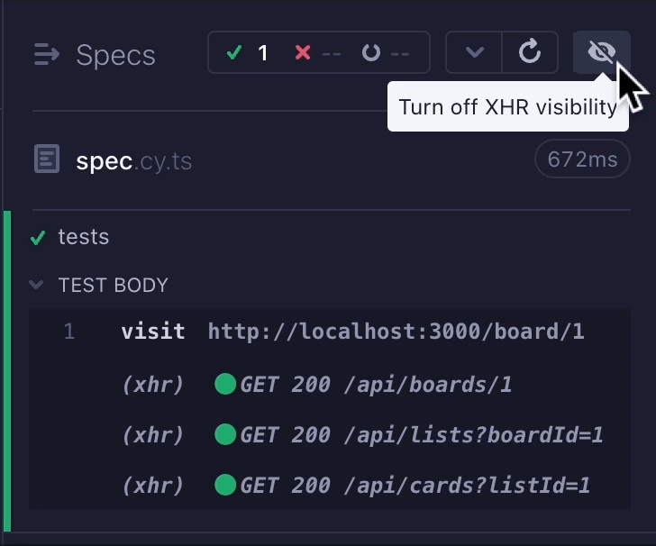

<h2 align=center>Cypress XHR toggle plugin</h2>
<p align="center">
<a href="https://github.com/sponsors/filiphric"></a>
</p>

<p align="center">
A small Cypress helper that de-clutters your timeline by hiding XHR requests.
</p>



### Installation

Install this package:
```bash
npm i cypress-plugin-xhr-toggle
# or
yarn add cypress-plugin-xhr-toggle
```

Import the plugin into your `cypress/support/e2e.js` file:
```js
import 'cypress-plugin-xhr-toggle'
// or
require('cypress-plugin-xhr-toggle')
```

### Usage
Open Cypress in GUI mode and see a new button. Click on it to hide all your XHR lines to de-clutter your timeline. You can set this up as default behavior by setting up `hideXhr` into your `env` object:

```ts
import { defineConfig } from "cypress";

export default defineConfig({
  fixturesFolder: false,
  e2e: {
    setupNodeEvents(on, config) {},
    env: {
      hideXhr: true
    }
  },
});
```

<hr>
<p align="center">
...powered by coffee and love ❤️  <a href="https://filiphric.com">Filip Hric
</p>